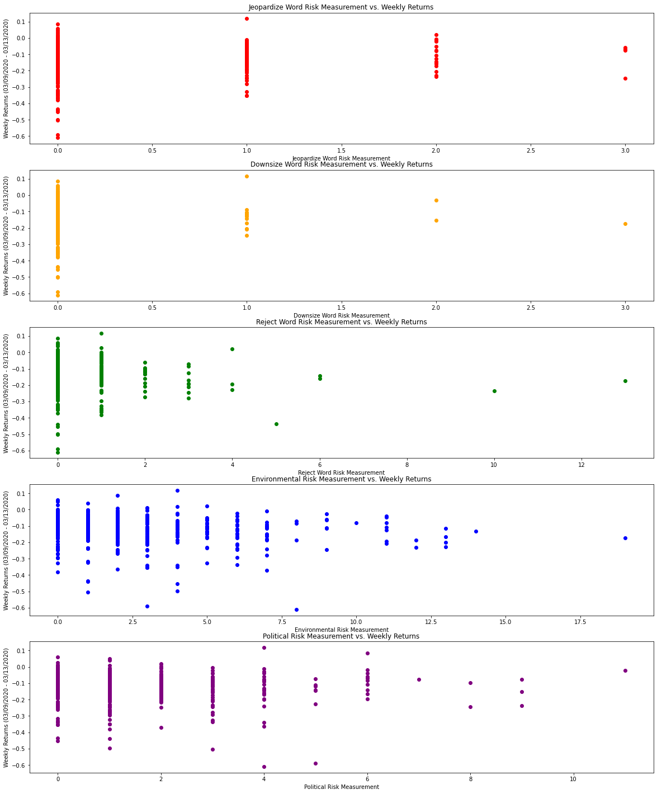

# Noah Sutherland Assignment 5

## Imports


```python
import pandas as pd 
import matplotlib.pyplot as plt
```

## Load Data


```python
df = pd.read_csv('output/sp500_accting_plus_textrisks.csv') # reads the sp500 firms with the risk and accounting data
df = df.drop('Unnamed: 0', 1) # drops the unneeded column
df = df.drop('_merge', 1) # drops the unneeded column
# df
```

    /var/folders/w3/3g6wsn0n125chnk_vvxdndl40000gn/T/ipykernel_17989/1533029064.py:2: FutureWarning: In a future version of pandas all arguments of DataFrame.drop except for the argument 'labels' will be keyword-only
      df = df.drop('Unnamed: 0', 1) # drops the unneeded column
    /var/folders/w3/3g6wsn0n125chnk_vvxdndl40000gn/T/ipykernel_17989/1533029064.py:3: FutureWarning: In a future version of pandas all arguments of DataFrame.drop except for the argument 'labels' will be keyword-only
      df = df.drop('_merge', 1) # drops the unneeded column


<div>
<style scoped>
    .dataframe tbody tr th:only-of-type {
        vertical-align: middle;
    }

    .dataframe tbody tr th {
        vertical-align: top;
    }

    .dataframe thead th {
        text-align: right;
    }
</style>
<table border="1" class="dataframe">
  <thead>
    <tr style="text-align: right;">
      <th></th>
      <th>Symbol</th>
      <th>Jeopardize_Word_Risk</th>
      <th>Downsize_Word_Risk</th>
      <th>Reject_Word_Risk</th>
      <th>Environmental_Risk</th>
      <th>Political_Risk</th>
      <th>gvkey</th>
      <th>lpermno</th>
      <th>datadate</th>
      <th>fyear</th>
      <th>...</th>
      <th>mb</th>
      <th>prof_a</th>
      <th>ppe_a</th>
      <th>cash_a</th>
      <th>xrd_a</th>
      <th>dltt_a</th>
      <th>invopps_FG09</th>
      <th>sales_g</th>
      <th>dv_a</th>
      <th>short_debt</th>
    </tr>
  </thead>
  <tbody>
    <tr>
      <th>0</th>
      <td>MMM</td>
      <td>1.0</td>
      <td>0.0</td>
      <td>0.0</td>
      <td>3.0</td>
      <td>0.0</td>
      <td>7435.0</td>
      <td>22592.0</td>
      <td>2019-12-31</td>
      <td>2019.0</td>
      <td>...</td>
      <td>3.046869</td>
      <td>0.193936</td>
      <td>0.228196</td>
      <td>0.065407</td>
      <td>0.042791</td>
      <td>0.408339</td>
      <td>2.749554</td>
      <td>NaN</td>
      <td>0.074252</td>
      <td>0.143810</td>
    </tr>
    <tr>
      <th>1</th>
      <td>AOS</td>
      <td>0.0</td>
      <td>0.0</td>
      <td>0.0</td>
      <td>0.0</td>
      <td>1.0</td>
      <td>9771.0</td>
      <td>65402.0</td>
      <td>2019-12-31</td>
      <td>2019.0</td>
      <td>...</td>
      <td>2.984500</td>
      <td>0.177698</td>
      <td>0.193689</td>
      <td>0.180314</td>
      <td>0.028744</td>
      <td>0.103303</td>
      <td>NaN</td>
      <td>NaN</td>
      <td>0.048790</td>
      <td>0.056170</td>
    </tr>
    <tr>
      <th>2</th>
      <td>ABT</td>
      <td>0.0</td>
      <td>0.0</td>
      <td>0.0</td>
      <td>1.0</td>
      <td>0.0</td>
      <td>1078.0</td>
      <td>20482.0</td>
      <td>2019-12-31</td>
      <td>2019.0</td>
      <td>...</td>
      <td>2.797149</td>
      <td>0.118653</td>
      <td>0.132161</td>
      <td>0.060984</td>
      <td>0.035942</td>
      <td>0.256544</td>
      <td>2.520681</td>
      <td>NaN</td>
      <td>0.033438</td>
      <td>0.088120</td>
    </tr>
    <tr>
      <th>3</th>
      <td>ABBV</td>
      <td>1.0</td>
      <td>0.0</td>
      <td>0.0</td>
      <td>1.0</td>
      <td>0.0</td>
      <td>16101.0</td>
      <td>13721.0</td>
      <td>2019-12-31</td>
      <td>2019.0</td>
      <td>...</td>
      <td>2.561071</td>
      <td>0.178107</td>
      <td>0.037098</td>
      <td>0.448005</td>
      <td>0.076216</td>
      <td>0.709488</td>
      <td>2.211589</td>
      <td>NaN</td>
      <td>0.071436</td>
      <td>0.057566</td>
    </tr>
    <tr>
      <th>4</th>
      <td>ABMD</td>
      <td>0.0</td>
      <td>0.0</td>
      <td>0.0</td>
      <td>4.0</td>
      <td>4.0</td>
      <td>13619.0</td>
      <td>75107.0</td>
      <td>2019-03-31</td>
      <td>2018.0</td>
      <td>...</td>
      <td>12.333838</td>
      <td>0.225749</td>
      <td>0.137531</td>
      <td>0.466354</td>
      <td>0.088683</td>
      <td>0.000000</td>
      <td>12.164233</td>
      <td>NaN</td>
      <td>0.000000</td>
      <td>NaN</td>
    </tr>
    <tr>
      <th>...</th>
      <td>...</td>
      <td>...</td>
      <td>...</td>
      <td>...</td>
      <td>...</td>
      <td>...</td>
      <td>...</td>
      <td>...</td>
      <td>...</td>
      <td>...</td>
      <td>...</td>
      <td>...</td>
      <td>...</td>
      <td>...</td>
      <td>...</td>
      <td>...</td>
      <td>...</td>
      <td>...</td>
      <td>...</td>
      <td>...</td>
      <td>...</td>
    </tr>
    <tr>
      <th>500</th>
      <td>YUM</td>
      <td>1.0</td>
      <td>0.0</td>
      <td>0.0</td>
      <td>1.0</td>
      <td>0.0</td>
      <td>65417.0</td>
      <td>85348.0</td>
      <td>2019-12-31</td>
      <td>2019.0</td>
      <td>...</td>
      <td>8.309310</td>
      <td>0.341853</td>
      <td>0.346396</td>
      <td>0.142038</td>
      <td>0.000000</td>
      <td>1.071959</td>
      <td>8.046718</td>
      <td>NaN</td>
      <td>0.097687</td>
      <td>0.044192</td>
    </tr>
    <tr>
      <th>501</th>
      <td>ZBRA</td>
      <td>0.0</td>
      <td>0.0</td>
      <td>0.0</td>
      <td>0.0</td>
      <td>1.0</td>
      <td>24405.0</td>
      <td>76795.0</td>
      <td>2019-12-31</td>
      <td>2019.0</td>
      <td>...</td>
      <td>3.537790</td>
      <td>0.192104</td>
      <td>0.077691</td>
      <td>0.006368</td>
      <td>0.094884</td>
      <td>0.250478</td>
      <td>3.225952</td>
      <td>NaN</td>
      <td>0.000000</td>
      <td>0.160740</td>
    </tr>
    <tr>
      <th>502</th>
      <td>ZBH</td>
      <td>0.0</td>
      <td>0.0</td>
      <td>0.0</td>
      <td>3.0</td>
      <td>1.0</td>
      <td>144559.0</td>
      <td>89070.0</td>
      <td>2019-12-31</td>
      <td>2019.0</td>
      <td>...</td>
      <td>1.748659</td>
      <td>0.102051</td>
      <td>0.095139</td>
      <td>0.025078</td>
      <td>0.021081</td>
      <td>0.281545</td>
      <td>1.556915</td>
      <td>NaN</td>
      <td>0.007983</td>
      <td>0.184000</td>
    </tr>
    <tr>
      <th>503</th>
      <td>ZION</td>
      <td>0.0</td>
      <td>0.0</td>
      <td>0.0</td>
      <td>5.0</td>
      <td>0.0</td>
      <td>NaN</td>
      <td>NaN</td>
      <td>NaN</td>
      <td>NaN</td>
      <td>...</td>
      <td>NaN</td>
      <td>NaN</td>
      <td>NaN</td>
      <td>NaN</td>
      <td>NaN</td>
      <td>NaN</td>
      <td>NaN</td>
      <td>NaN</td>
      <td>NaN</td>
      <td>NaN</td>
    </tr>
    <tr>
      <th>504</th>
      <td>ZTS</td>
      <td>0.0</td>
      <td>0.0</td>
      <td>0.0</td>
      <td>2.0</td>
      <td>2.0</td>
      <td>13721.0</td>
      <td>13788.0</td>
      <td>2019-12-31</td>
      <td>2019.0</td>
      <td>...</td>
      <td>6.216815</td>
      <td>0.218709</td>
      <td>0.184409</td>
      <td>0.167518</td>
      <td>0.039584</td>
      <td>0.529320</td>
      <td>6.019250</td>
      <td>NaN</td>
      <td>0.027198</td>
      <td>0.080500</td>
    </tr>
  </tbody>
</table>
<p>505 rows × 44 columns</p>
</div>


## Explain Risk Measurements
### Risk Factor 1 (Negative Connotation Words)
My first risk factors included words that have a generally negative association with 10k files according to https://augmentedtrader.com/2014/12/18/50-words-you-dont-want-to-see-in-a-10-k-sec-filing/ and I wanted to fact check the website by conducting my own analysis of these "negative" words. The first word I chose was jeopardize, and I used three different variations of jeopardize including jeopardzie, jeopardizing, and jeopardized. I chose this word because like the other words I chose, jeopardize is a negative word even when used outside of the context of a 10k I believed before doing the analysis that jeopardize would show up in 10k's of companies that did not perform as well as others. The next word I chose was downsize, and I also used three different variations of this including downsize, downsized, and downsizing to capture all words. Downsize is more specific to a companies performance and their future plans and I believed before doing the analysis that this would correlate with lower stock returns. Lastly, I chose reject and did four variations of this including reject, rejects, rejected, and rejecting. This word was similar to jeopardize in the fact that reject is a negative word even when used outside of a 10k or in the context of a company, and so I wanted to see the difference between a word like this, and a word like downsize that is negative specifically in the context of a company.
### Risk Factor 2 (Environmental Risk)
My next risk factor I wanted to focus on was environmental risks as this is generally a topic that interests me and the environment in things like ESG has been starting to play a more and more prevelant role in returns. Instead of using singular words like I tried above, for this I used a combination of prevelant words to the environment. The first group of words I used included environmental, environment, world, earth, and environments. The second grouping of words I used was change, changing, risk, risky, risks, and changes to provide a negative connotation with these environmental risks. I chose to do this measure with a spacing of five words in between the two groups as I don't necessarily feel like these words would come one after the other, however my computer was crashing when I tried 10 and 20 words apart which I think would give more accurate risk measures for environmental risk if you are running it on a more powerful computer. 
### Risk Factor 3 (Political Risk)
My last risk factor I used were political risks because of all that has been going in recent time with the "insider" trading of politicians. I was curious to see if political words also had a negative effect on the returns of a firm during this time period. This political risk measure was done in a similar way to the environmental risk as I did this using two groupings of words. The first group of words were politics, politic, political, politician, senate, senator, congress, democrat, republican, and policy. The second group of words included risk, risky, risks, bad, change, negative, negatively, negatives, changes, changing to provide a negative connotation with the first group of words. I did these groupings of words with a spacing of 2 because I felt that these words when speaking about politics specifically would come one after the other in many cases, and from my results we see that to be true with the highest risk measure of 11. This could be changed to go to 5 and even 10 for a different analysis, and there are also words that could be added. An additional thought with more time could be to study the difference between 10k's that talk about Democrats vs. Republicans and how these firms fair. 

## Stock Returns


```python
new_df = pd.read_stata('2019-2020-stock_rets cleaned.dta') # reads the cleaned stock return data provided to us and stores it in a dataframe
new_df = new_df.drop('_merge', 1) # drops the unneeded column _merge (when I didn't do this it gave me an error because when merging again it creates the _merge column)
new_df.rename(columns = {"ticker":"Symbol"}, inplace = True) # changes the column ticker to Symbol
start_date = 20200309 # initializes the start data as 03/09/2020
end_date = 20200313 # initializes the end date as 03/13/2020
correct_dates = (new_df['date'] >= start_date) & (new_df['date'] <= end_date) # makes a new variable that is the correct dates that goes into the dataframe
new_df = new_df.loc[correct_dates].set_index('date') # adds the correct dates into the date column and removes those that aren't included
new_df['ret'] = pd.to_numeric(new_df['ret']) # makes the returns numeric so we can operate on them below
new_df = (new_df.assign(ret_weekly = 1 + new_df['ret']).groupby('Symbol')['ret_weekly'].prod() - 1) # formula used earlier in the class to make these returns weekly
new_df = new_df.to_frame().reset_index() # formatting the dataframe to just the symbol and the weekly return for that symbol over the above start and end dates
# new_df
whole_df = pd.merge(df, new_df, how = 'left', on = ['Symbol'], validate = 'one_to_one', indicator = True) # merges the dataframe with the risk measures and the accounting data with these new weekly returns
# whole_df
```

    /var/folders/w3/3g6wsn0n125chnk_vvxdndl40000gn/T/ipykernel_17989/2624028312.py:2: FutureWarning: In a future version of pandas all arguments of DataFrame.drop except for the argument 'labels' will be keyword-only
      new_df = new_df.drop('_merge', 1) # drops the unneeded column _merge (when I didn't do this it gave me an error because when merging again it creates the _merge column)


<div>
<style scoped>
    .dataframe tbody tr th:only-of-type {
        vertical-align: middle;
    }

    .dataframe tbody tr th {
        vertical-align: top;
    }

    .dataframe thead th {
        text-align: right;
    }
</style>
<table border="1" class="dataframe">
  <thead>
    <tr style="text-align: right;">
      <th></th>
      <th>Symbol</th>
      <th>Jeopardize_Word_Risk</th>
      <th>Downsize_Word_Risk</th>
      <th>Reject_Word_Risk</th>
      <th>Environmental_Risk</th>
      <th>Political_Risk</th>
      <th>gvkey</th>
      <th>lpermno</th>
      <th>datadate</th>
      <th>fyear</th>
      <th>...</th>
      <th>ppe_a</th>
      <th>cash_a</th>
      <th>xrd_a</th>
      <th>dltt_a</th>
      <th>invopps_FG09</th>
      <th>sales_g</th>
      <th>dv_a</th>
      <th>short_debt</th>
      <th>ret_weekly</th>
      <th>_merge</th>
    </tr>
  </thead>
  <tbody>
    <tr>
      <th>0</th>
      <td>MMM</td>
      <td>1.0</td>
      <td>0.0</td>
      <td>0.0</td>
      <td>3.0</td>
      <td>0.0</td>
      <td>7435.0</td>
      <td>22592.0</td>
      <td>2019-12-31</td>
      <td>2019.0</td>
      <td>...</td>
      <td>0.228196</td>
      <td>0.065407</td>
      <td>0.042791</td>
      <td>0.408339</td>
      <td>2.749554</td>
      <td>NaN</td>
      <td>0.074252</td>
      <td>0.143810</td>
      <td>-0.077905</td>
      <td>both</td>
    </tr>
    <tr>
      <th>1</th>
      <td>AOS</td>
      <td>0.0</td>
      <td>0.0</td>
      <td>0.0</td>
      <td>0.0</td>
      <td>1.0</td>
      <td>9771.0</td>
      <td>65402.0</td>
      <td>2019-12-31</td>
      <td>2019.0</td>
      <td>...</td>
      <td>0.193689</td>
      <td>0.180314</td>
      <td>0.028744</td>
      <td>0.103303</td>
      <td>NaN</td>
      <td>NaN</td>
      <td>0.048790</td>
      <td>0.056170</td>
      <td>-0.028109</td>
      <td>both</td>
    </tr>
    <tr>
      <th>2</th>
      <td>ABT</td>
      <td>0.0</td>
      <td>0.0</td>
      <td>0.0</td>
      <td>1.0</td>
      <td>0.0</td>
      <td>1078.0</td>
      <td>20482.0</td>
      <td>2019-12-31</td>
      <td>2019.0</td>
      <td>...</td>
      <td>0.132161</td>
      <td>0.060984</td>
      <td>0.035942</td>
      <td>0.256544</td>
      <td>2.520681</td>
      <td>NaN</td>
      <td>0.033438</td>
      <td>0.088120</td>
      <td>-0.001101</td>
      <td>both</td>
    </tr>
    <tr>
      <th>3</th>
      <td>ABBV</td>
      <td>1.0</td>
      <td>0.0</td>
      <td>0.0</td>
      <td>1.0</td>
      <td>0.0</td>
      <td>16101.0</td>
      <td>13721.0</td>
      <td>2019-12-31</td>
      <td>2019.0</td>
      <td>...</td>
      <td>0.037098</td>
      <td>0.448005</td>
      <td>0.076216</td>
      <td>0.709488</td>
      <td>2.211589</td>
      <td>NaN</td>
      <td>0.071436</td>
      <td>0.057566</td>
      <td>-0.038844</td>
      <td>both</td>
    </tr>
    <tr>
      <th>4</th>
      <td>ABMD</td>
      <td>0.0</td>
      <td>0.0</td>
      <td>0.0</td>
      <td>4.0</td>
      <td>4.0</td>
      <td>13619.0</td>
      <td>75107.0</td>
      <td>2019-03-31</td>
      <td>2018.0</td>
      <td>...</td>
      <td>0.137531</td>
      <td>0.466354</td>
      <td>0.088683</td>
      <td>0.000000</td>
      <td>12.164233</td>
      <td>NaN</td>
      <td>0.000000</td>
      <td>NaN</td>
      <td>-0.090781</td>
      <td>both</td>
    </tr>
    <tr>
      <th>...</th>
      <td>...</td>
      <td>...</td>
      <td>...</td>
      <td>...</td>
      <td>...</td>
      <td>...</td>
      <td>...</td>
      <td>...</td>
      <td>...</td>
      <td>...</td>
      <td>...</td>
      <td>...</td>
      <td>...</td>
      <td>...</td>
      <td>...</td>
      <td>...</td>
      <td>...</td>
      <td>...</td>
      <td>...</td>
      <td>...</td>
      <td>...</td>
    </tr>
    <tr>
      <th>500</th>
      <td>YUM</td>
      <td>1.0</td>
      <td>0.0</td>
      <td>0.0</td>
      <td>1.0</td>
      <td>0.0</td>
      <td>65417.0</td>
      <td>85348.0</td>
      <td>2019-12-31</td>
      <td>2019.0</td>
      <td>...</td>
      <td>0.346396</td>
      <td>0.142038</td>
      <td>0.000000</td>
      <td>1.071959</td>
      <td>8.046718</td>
      <td>NaN</td>
      <td>0.097687</td>
      <td>0.044192</td>
      <td>-0.122372</td>
      <td>both</td>
    </tr>
    <tr>
      <th>501</th>
      <td>ZBRA</td>
      <td>0.0</td>
      <td>0.0</td>
      <td>0.0</td>
      <td>0.0</td>
      <td>1.0</td>
      <td>24405.0</td>
      <td>76795.0</td>
      <td>2019-12-31</td>
      <td>2019.0</td>
      <td>...</td>
      <td>0.077691</td>
      <td>0.006368</td>
      <td>0.094884</td>
      <td>0.250478</td>
      <td>3.225952</td>
      <td>NaN</td>
      <td>0.000000</td>
      <td>0.160740</td>
      <td>-0.092335</td>
      <td>both</td>
    </tr>
    <tr>
      <th>502</th>
      <td>ZBH</td>
      <td>0.0</td>
      <td>0.0</td>
      <td>0.0</td>
      <td>3.0</td>
      <td>1.0</td>
      <td>144559.0</td>
      <td>89070.0</td>
      <td>2019-12-31</td>
      <td>2019.0</td>
      <td>...</td>
      <td>0.095139</td>
      <td>0.025078</td>
      <td>0.021081</td>
      <td>0.281545</td>
      <td>1.556915</td>
      <td>NaN</td>
      <td>0.007983</td>
      <td>0.184000</td>
      <td>-0.211926</td>
      <td>both</td>
    </tr>
    <tr>
      <th>503</th>
      <td>ZION</td>
      <td>0.0</td>
      <td>0.0</td>
      <td>0.0</td>
      <td>5.0</td>
      <td>0.0</td>
      <td>NaN</td>
      <td>NaN</td>
      <td>NaN</td>
      <td>NaN</td>
      <td>...</td>
      <td>NaN</td>
      <td>NaN</td>
      <td>NaN</td>
      <td>NaN</td>
      <td>NaN</td>
      <td>NaN</td>
      <td>NaN</td>
      <td>NaN</td>
      <td>-0.166100</td>
      <td>both</td>
    </tr>
    <tr>
      <th>504</th>
      <td>ZTS</td>
      <td>0.0</td>
      <td>0.0</td>
      <td>0.0</td>
      <td>2.0</td>
      <td>2.0</td>
      <td>13721.0</td>
      <td>13788.0</td>
      <td>2019-12-31</td>
      <td>2019.0</td>
      <td>...</td>
      <td>0.184409</td>
      <td>0.167518</td>
      <td>0.039584</td>
      <td>0.529320</td>
      <td>6.019250</td>
      <td>NaN</td>
      <td>0.027198</td>
      <td>0.080500</td>
      <td>-0.084422</td>
      <td>both</td>
    </tr>
  </tbody>
</table>
<p>505 rows × 46 columns</p>
</div>


## Stock Returns vs. Risk Measurements


```python
figure, subplot = plt.subplots(5, figsize = (20, 25)) # creates 5 subplots with a specified size
subplot[0].scatter(x = whole_df['Jeopardize_Word_Risk'], y = whole_df['ret_weekly'], color = 'red') # creates the first subplot that uses the jeopardize word risk and the weekly returns as the x and y with the color red as the points
# formatting of title, x-axis label, and y-axis label
subplot[0].set_title("Jeopardize Word Risk Measurement vs. Weekly Returns")
subplot[0].set_xlabel("Jeopardize Word Risk Measurement")
subplot[0].set_ylabel("Weekly Returns (03/09/2020 - 03/13/2020)")

subplot[1].scatter(x = whole_df['Downsize_Word_Risk'], y = whole_df['ret_weekly'], color = 'orange') # creates the second subplot that uses the downsize word risk and the weekly returns as the x and y with the color orange as the points
# formatting of title, x-axis label, and y-axis label
subplot[1].set_title("Downsize Word Risk Measurement vs. Weekly Returns")
subplot[1].set_xlabel("Downsize Word Risk Measurement")
subplot[1].set_ylabel("Weekly Returns (03/09/2020 - 03/13/2020)")

subplot[2].scatter(x = whole_df['Reject_Word_Risk'], y = whole_df['ret_weekly'], color = 'green') # creates the third subplot that uses the reject word risk and the weekly returns as the x and the y with the color green as the points
# formatting of title, x-axis label, and y-axis label
subplot[2].set_title("Reject Word Risk Measurement vs. Weekly Returns")
subplot[2].set_xlabel("Reject Word Risk Measurement")
subplot[2].set_ylabel("Weekly Returns (03/09/2020 - 03/13/2020)")

subplot[3].scatter(x = whole_df['Environmental_Risk'], y = whole_df['ret_weekly'], color = 'blue') # creates the fourth subplot that uses the environmental risk and the weekly returns as the x and the y with the color blue as the points
# formatting of title, x-axis label, and y-axis label
subplot[3].set_title("Environmental Risk Measurement vs. Weekly Returns")
subplot[3].set_xlabel("Environmental Risk Measurement")
subplot[3].set_ylabel("Weekly Returns (03/09/2020 - 03/13/2020)")

subplot[4].scatter(x = whole_df['Political_Risk'], y = whole_df['ret_weekly'], color = 'purple') # creates the fifth subplot that uses the political risk and the weekly returns as the x and the y with the color purple as the points
# formatting of title, x-axis label, and y-axis label
subplot[4].set_title("Political Risk Measurement vs. Weekly Returns")
subplot[4].set_xlabel("Political Risk Measurement")
subplot[4].set_ylabel("Weekly Returns (03/09/2020 - 03/13/2020)")

plt.show() # prints out the scatter plots
```


    

    


## Analysis of Above Scatterplots
### Jeopardize Risk Measure
The jeopardize risk measure scatterplot above shows that the highest returns, which are still generally negative for the week of 03/09/2020-03/13/2020, were with a risk measurement of 0. This means that if the word jeopardize didn't show up at all in a firm's 10k, that firm generally performed better than a firm who had the word jeopardize show up, generally showing what we expected to be the case with this negative word. This of course was not the case every time, but on average there is a correlation between the stock return of a firm and their jeopardize word risk measure, in this case being that if the risk measure was low, there was a higher stock return during this week. 
### Downsize Risk Measure
The downsize word risk measure also performs similarely to that of jeopardize. Both of these words are not used commonly in firms 10k's unsurprisingly because if an investor were to see these words, it would likely scare them away. Because of this both of these risk measures have max occurances of 3, and they are only a few firms in both cases that are above 0. Downsize similar to jeopardize has a larger chunk of higher returns when the word downsize is not used at all. While there isn't an especially clear correlation, there seems to be a slight downward trend when the word downsize is used more than 0 times in the 10k.
### Reject Risk Measure
The reject word risk measure has a slightly clearer downward trend than the above two, with more occurances of above 0 than the other two as well meaning that reject and the words like it show up more commonly in 10k's than jeopardize or downsizing, giving us a better look into the correlation of this risk measure to the weekly returns of that firm. In this case, if risk is found more than 0 times, the firm will generally perform worse, as expected, than a 10k that used the word reject. 
### Environmental Risk Measure
The environmental risk measure in comparison to the above three had a much higher average risk measure, however there was not as clear of a correlation for these numbers as the above three. Based on the scatterplot above, I would say that it would be useful to change around the spacing of the words and the words themselves in each of the two groups to get some different results and see if there is correlation with other inputs. In this case however purely reviewing the above scatterplot for environmental risk there is no real conclusion from that data.
### Political Risk Measure
Political risk measure also had a higher average risk measure than the first three word risk measures, however was also slightly unclear as to the correlation between the risk measure and the weekly returns. In comparison to the environmental risk measure however the political risk measure had slightly more correlation as far as better returns for lower risk measures. This was not always the case but generally was. I think it would be interesting to conduct this same political risk measure research during an election period, or even on returns and 10k's now with all that is going on with politicians and their "insider" trading. 


## Output Firms With High Scores


```python
# these are for loops that run through the entire dataframe and check to see which firms have the highest risk measures, so we can analyze them below

print('High Jeopardize Word Risk') # formatting
for index, row in df.iterrows(): 
    if(row['Jeopardize_Word_Risk'] > 2):
        print(row['Symbol'])

print('High Downsize Word Risk') # formatting
for index, row in df.iterrows():
    if(row['Downsize_Word_Risk'] > 1):
        print(row['Symbol'])

print('High Reject Word Risk') # formatting
for index, row in df.iterrows():
    if(row['Reject_Word_Risk'] > 5):
        print(row['Symbol'])

print('High Environmental Risk') # formatting
for index, row in df.iterrows():
    if(row['Environmental_Risk'] > 13):
        print(row['Symbol'])

print('High Political Risk') # formatting
for index, row in df.iterrows():
    if(row['Political_Risk'] > 10):
        print(row['Symbol'])
```

    High Jeopardize Word Risk
    IRM
    FB
    SRE
    UDR
    High Downsize Word Risk
    BBY
    INCY
    VNO
    High Reject Word Risk
    ETR
    PEAK
    MGM
    NRG
    High Environmental Risk
    ETR
    TRV
    High Political Risk
    STT


### High Environmental Risk:
The first company that has a high risk measure for environmental risk is Entergy Corpration which is an integrated energy company the engages primarily in electric power production. The next one is Travelers Companies Inc which is an American insurance company. Entergy Corporation makes the most sense here as they are a company that interacts with the environment on a daily basis, showing that the code in my measure_risk file is reading the 10k's correctly and assigning the correct risk measures.
### High Political Risk:
STT is State Street Corporation, which is an American financial services and bank holding company. This is not as clear cut as Entergy Corporation above, but makes sense when linked to political risk. Because I used the same code from the environmental risk with the political risk, this should work and the company with the highest political risk measure being a financial services and bank holding company makes sense with the policy surrounding banks and the financial services sector.

Note: I did not include the specific words becasue these words are very general and could be found in any firms 10k. In the case of my code, I used the same code for all of the risk measures just with different words, spacings, and in the case of the single words, groupings so it is assumed that the code worked for the single words as well as the environmental and political risk measurements. 
